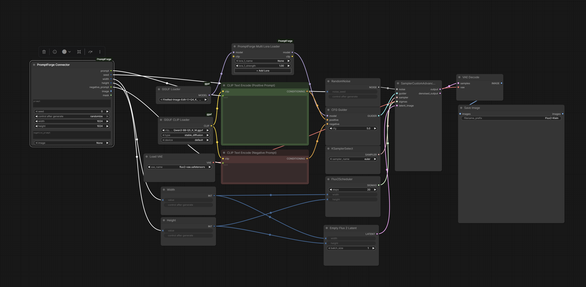

# PromptForge Connection

A ComfyUI custom node package + HTTP bridge for the
[PromptForge](https://github.com/SirZavod/PromptForge/tree/main#connecting-to-comfyui) desktop app.

**The workflow** (once this package is installed):

1. Open ComfyUI in your browser, build your graph, place a
   **PromptForge Connector** node in it (and, optionally, a
   **PromptForge Multi Lora Loader**).
2. Open PromptForge, check "ComfyUI connected?".
3. That's it — generate from PromptForge. No file exports, no manual steps.

The JS extension pushes the live canvas graph to the PromptForge app
automatically every time you change anything, including switching
workflows in the browser.

---


## Installation

Open your terminal in the `ComfyUI/custom_nodes` folder and run the following command. It will automatically clone the repository and create the `PromptForge` directory:

```bash
git clone [https://github.com/SirZavod/PromptForge-Nodes.git](https://github.com/SirZavod/PromptForge-Nodes.git) PromptForge
```
## ⚠️ Important: generation always targets the *last active* workflow

PromptForge does **not** know about "tabs" or "which workflow you meant."
The bridge keeps exactly one cached graph, server-side, and every push
overwrites it — last write wins, globally, for the whole ComfyUI server.

What that means in practice:

- Whichever workflow tab you had **selected last** in the ComfyUI browser
  window is the one PromptForge will submit to — even if you've since
  closed that tab, or closed the browser entirely. The push already
  happened; the cached graph doesn't need the browser to stay open.
- Got two (or more) workflows open with a Connector node in each — say
  one wired into an **Anima** graph and one into a **Klein** graph? Switch
  to the Klein tab in the browser for a second (even without touching
  anything — just clicking the tab is enough to make it the active one),
  then go back to PromptForge: your next generation goes to Klein. Switch
  back to Anima's tab, and it goes to Anima again.
- This applies to **everything** patched onto the graph, not just the
  prompt/seed/resolution — LoRA Manager selections submit against
  whichever workflow is currently cached, so if you flip workflows without
  noticing, your LoRAs apply to a different model/graph than you expect.
- We'll ship example workflow JSONs (Anima, Klein, Z-Image Turbo) wired up
  with the Connector node so this is easy to see in practice rather than
  just read about.

**Rule of thumb:** before generating, glance at which ComfyUI tab/workflow
was open last — that's where the job is going.

---

## How it works

### Python side (`nodes.py`)

Three responsibilities:

1. **`PromptForgeConnection` node** — pure passthrough. 5 inputs
   (`prompt`, `seed`, `width`, `height`, `negative_prompt`) → 5 outputs of
   the same types and names. PromptForge finds this node by `class_type`
   in the fetched graph and patches these five values before submitting
   to `/prompt`. Works as a normal node for manual use too — nothing
   about it requires PromptForge to be running.

2. **`PromptForgeMultiLoraLoader` node** — applies up to 30 LoRAs
   sequentially to a model (and optionally CLIP — CLIP is only needed for
   UNET-style models; DiT models can leave it unconnected). Each slot's
   dropdown is populated from ComfyUI's own indexed LoRA list
   (`folder_paths.get_filename_list("loras")`), the exact same source
   the built-in LoRA loader uses, so names always match what the node
   actually receives at execution time. Only the first slot is visible by
   default — see the JS side below for how the rest unlock.

3. **HTTP bridge routes**, registered on the ComfyUI server:

   | Route | Method | Role |
   |---|---|---|
   | `/promptforge/graph` | `POST` | Receives graph snapshots pushed by the JS extension |
   | `/promptforge/graph` | `GET`  | Returns the latest snapshot to PromptForge |
   | `/promptforge/loras` | `GET`  | Returns the list of LoRA files ComfyUI currently sees, for PromptForge's LoRA Manager dropdowns and library bindings |
   | `/promptforge/output_dir` | `GET` | Returns ComfyUI's real `output/` directory, so PromptForge's "Open folder" / Gallery "reveal in explorer" can point at the actual files instead of guessing |

### Browser side (`web/promptforge_bridge.js`)

Loaded automatically by ComfyUI as a frontend extension. It:
- Calls `app.graphToPrompt()` (ComfyUI's own serializer) to get the
  current canvas graph in API format on every meaningful change (node
  add/remove, link change, widget edit, workflow load, before every
  queued prompt).
- POSTs the result to `/promptforge/graph`.

This means PromptForge always has the live state of whatever graph was
most recently active in the browser — no manual "Export (API)" step, no
saved JSON file.

### Browser side (`web/promptforge_lora_ui.js`)

`PromptForgeMultiLoraLoader` exposes all 30 LoRA slot pairs as inputs so
the Python side can support that many, but a node with 30 pairs of
widgets visible at once would be unusable. This extension:
- Hides every slot beyond the first on node creation.
- Adds a **"+ Add Lora"** button that reveals the next slot.
- Adds a 🗑 delete button on every slot except the first, which removes
  that slot, shifts everything above it down by one, and re-hides the
  freed slot at the end.
- Re-derives which slots should be visible from the actual widget values
  whenever a saved workflow is loaded (slot visibility is UI-only state,
  not part of the saved graph).

`MAX_SLOTS` in this file must stay in sync with `LORA_SLOTS` in
`nodes.py` (currently 30).

---

## Install

Copy the whole node package folder into `ComfyUI/custom_nodes/`:

```
ComfyUI/custom_nodes/PromptForge/
├── __init__.py
├── nodes.py
├── web/
│   ├── promptforge_bridge.js
│   └── promptforge_lora_ui.js
├── pyproject.toml
└── README.md
```

Restart ComfyUI, then **reload the browser tab** (the JS extensions load
at page load time). The nodes appear under:
- **Add Node → PromptForge → PromptForge Connector**
- **Add Node → PromptForge → PromptForge Multi Lora Loader**

No extra Python packages required — everything used (`aiohttp`, `folder_paths`,
`comfy.sd`, `comfy.utils`) ships with ComfyUI itself.

---

## Wire your graph

### PromptForge Connector

| Output | Wire to |
|---|---|
| `prompt` | Positive `CLIPTextEncode` → `text` input |
| `negative_prompt` | Negative `CLIPTextEncode` → `text` input |
| `seed`   | `KSampler` → `seed` input |
| `width`  | `EmptyLatentImage` → `width` input |
| `height` | `EmptyLatentImage` → `height` input |

Make sure your graph has a **SaveImage** node — that's how PromptForge
finds the result image after generation.

### PromptForge Multi Lora Loader (optional)

Drop it between your checkpoint/model loader and the rest of the graph:

```
CheckpointLoader → model ──▶ PromptForge Multi Lora Loader → model ──▶ KSampler
                  → clip  ──▶ (optional)                   → clip  ──▶ CLIPTextEncode
```

Leave `clip` unconnected for DiT-style models that don't train CLIP
weights in their LoRAs. Pick `None` in any slot's dropdown to leave it
empty — PromptForge's LoRA Manager (and its auto-fill-from-library
feature) drives these slots directly when connected.

That's the entire setup. Subsequent workflow switches (opening a
different `.json`, or just clicking a different open tab — see the
warning above) are picked up automatically, as long as the browser tab
stays reachable by the ComfyUI server.

---

## Manual use (without PromptForge)

Both nodes work like any other ComfyUI node: type a prompt, set seed /
resolution, pick LoRAs, queue normally. Nothing about them requires
PromptForge to be running or even installed.

---

## Field reference

### PromptForge Connector

| Field    | Type              | Range                   | Notes |
|---|---|---|---|
| `prompt` | STRING (multiline) | —                       | Overwritten by PromptForge on submit |
| `negative_prompt` | STRING (multiline) | —             | Overwritten by PromptForge on submit |
| `seed`   | INT               | 0 – 4 294 967 295       | Overwritten by PromptForge on submit (already resolved) |
| `width`  | INT               | 64 – 8 192 (step 8)     | Overwritten by PromptForge on submit |
| `height` | INT               | 64 – 8 192 (step 8)     | Overwritten by PromptForge on submit |

### PromptForge Multi Lora Loader

| Field | Type | Range | Notes |
|---|---|---|---|
| `model` | MODEL | — | Required |
| `clip` | CLIP | — | Optional — only needed for UNET-style models |
| `lora_N_name` | COMBO | indexed LoRA list, `"None"` to skip | Up to 30 slots, only slot 1 visible by default |
| `lora_N_strength` | FLOAT | -16.0 – 16.0 | Applied identically to both UNET and CLIP patching |

---

## License

Public domain — [The Unlicense](https://unlicense.org/).
